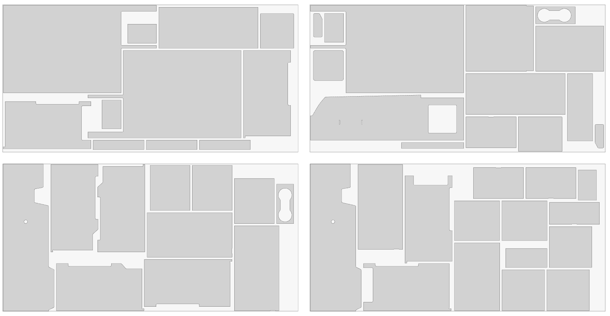

# Nest project

Project for efficient polygon nesting and packing. This project leverages Rust's performance for computational geometry and Node.js for scripting and integration. Work in progress...



## Features
- Fast polygon nesting algorithms
- Node.js integration for scripting and automation
- Easily extensible for custom workflows

## Getting Started

### Prerequisites
- [Rust](https://www.rust-lang.org/tools/install)
- [Node.js](https://nodejs.org/)

### Install

#### Rust
```sh
cargo build --release
```

#### Node.js
```sh
yarn install
# or
npm install
```

## Development Tips

For best Rust development experience, use [rust-analyzer](https://rust-analyzer.github.io/) and enable Clippy on autosave:

```json
    "rust-analyzer.check.overrideCommand": [
        "cargo",
        "clippy",
        "--fix",
        "--workspace",
        "--message-format=json",
        "--all-targets",
        "--allow-dirty"
    ],
```
